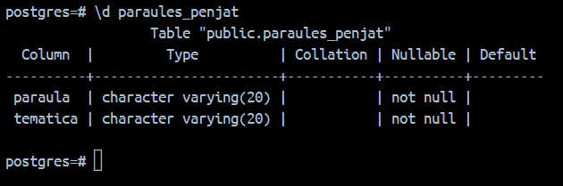
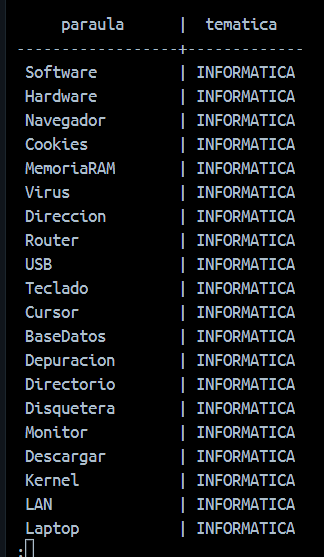
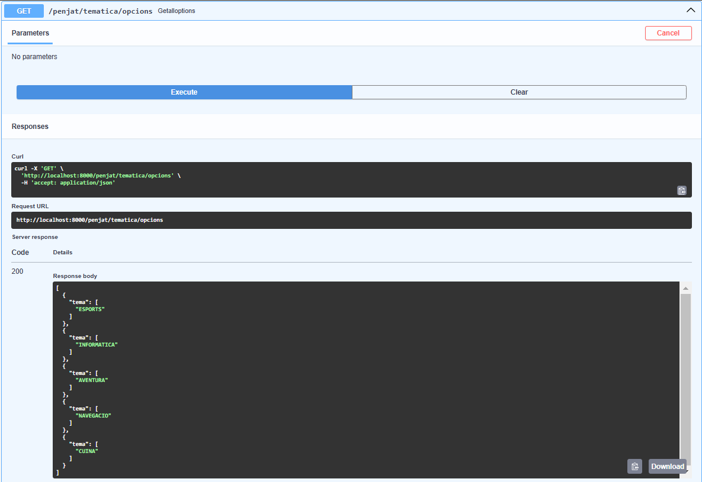
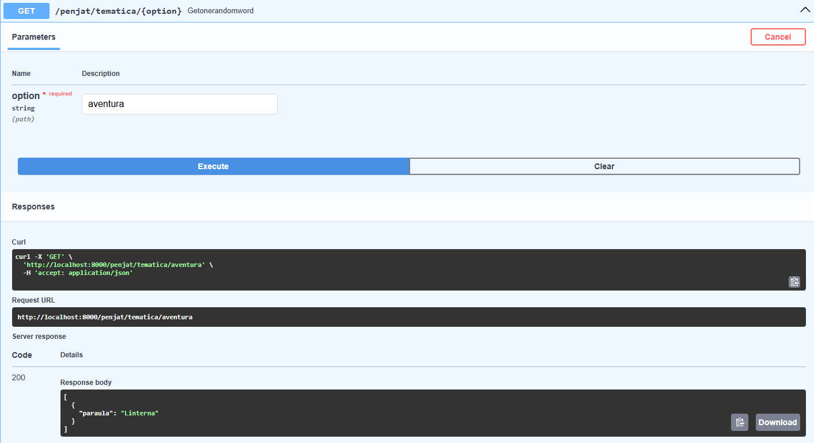
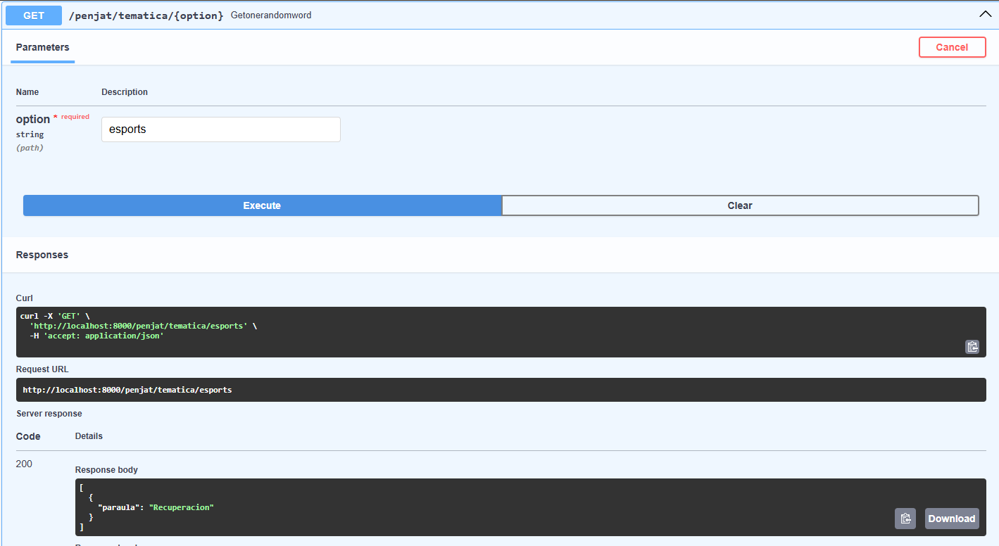
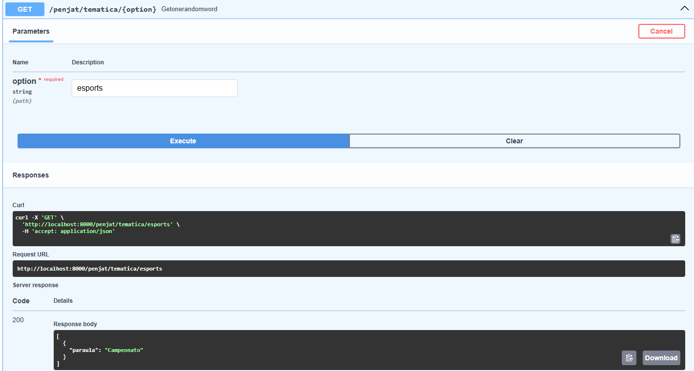

# Activitat 10

## Inserció a la base de dades

Hem de tenir un taula i un fitxer .csv amb les dades:

Una vegada llegim el fitxer .csv fem un recorregut del DataFrame 
i per cada fila (paraula, tematica), inserim un registre amb les dades.

## Obtenir tematiques

Aprofitarem la conexio que hem fet abans i farme un select DISTINCT 
de les tematiques, amb aixo ja podrem tractar les dades i obtenir 
el JSON amb les tamatiques:

## Obtenir una paraula a l'atzar

A continuació volem obtenir una paraula a l'atzar filtrant per tematica asi que
haurem de rebre la tematica per aconseguir tan sols les paraules d'aquesta i
agafar una random, exemples:

- 1

- 2

- 3

