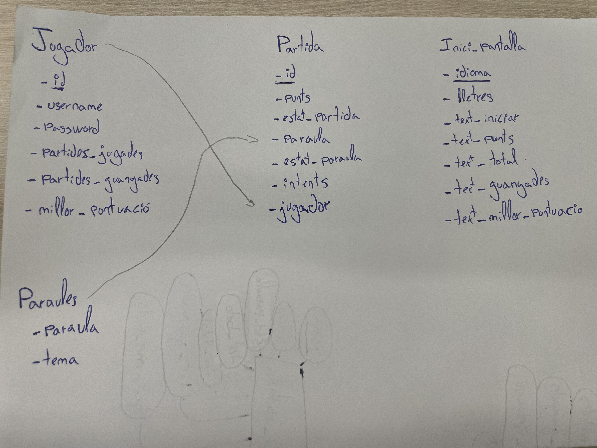
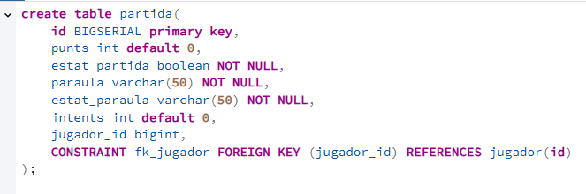

# Activitat 11

## Esquema de la base de dades:

Queries:

A la taula de jugador he afegit el camp de data per la millor puntuacio per tenir millor estructura de dades.

- Jugador:

- Partida

- Inici pantalla:

## END POINTS

### Get Informació inicial de la pantalla

Per temes d'optimitzacio de codi he obviat el end point on tan sols recuperem el text de començar partida i he ficat un on rescatem totes les dades inicials que es demanen.

### Get intents de partida

En aquest pas tan sols rebrem el numero de intents actuals de la partida:

### Post augmentar intents

A continuació augmentarem el numero de intents de la partida, a més retornara el nº de intents.

### Get alfabet

Aqui rebrem un string amb tots els caracters disponibles:

### Get puntuació del jugador

Per finalitzar agafarem les dades dels punts del jugador:

