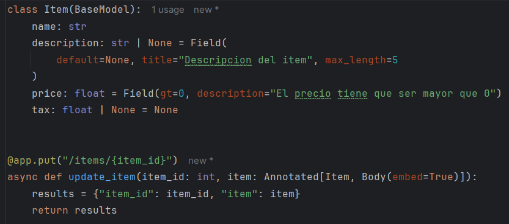
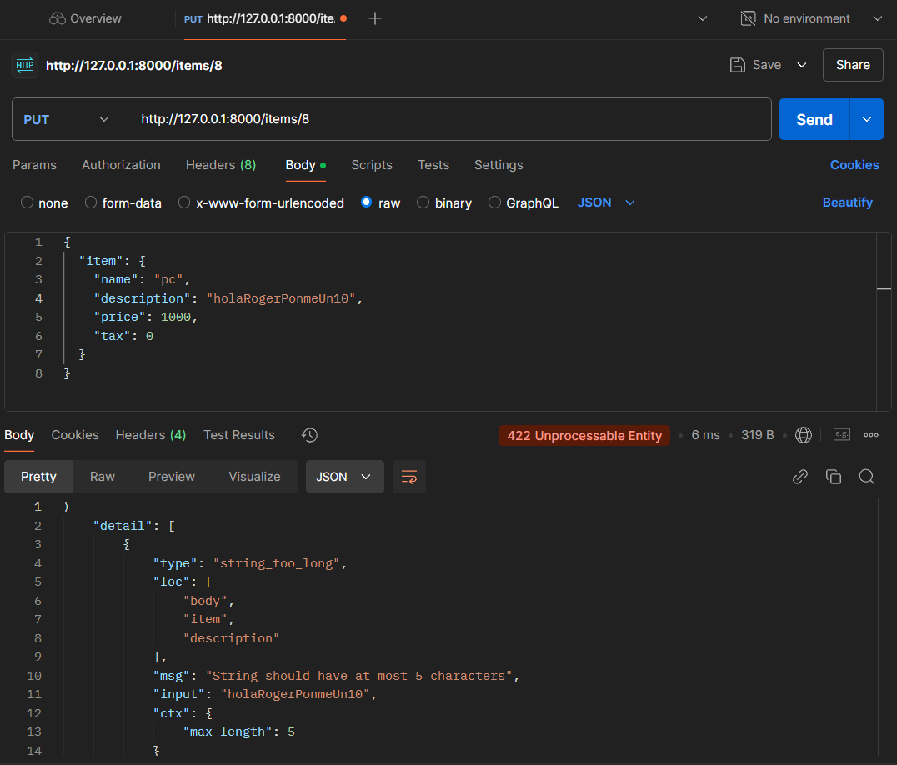
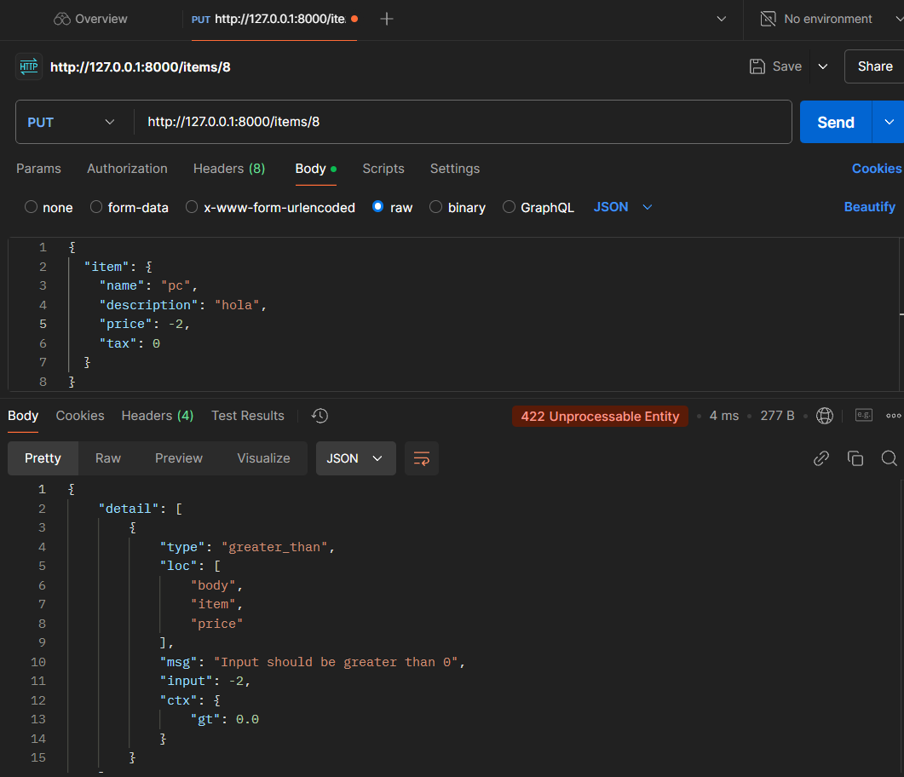
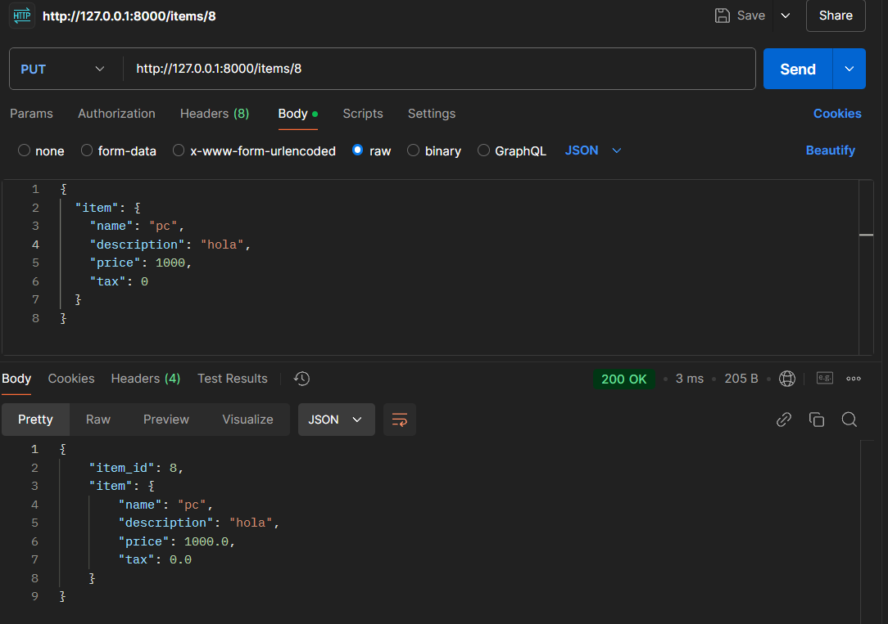
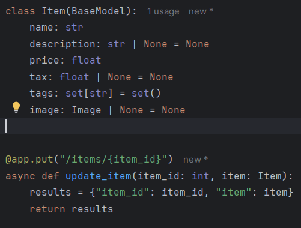
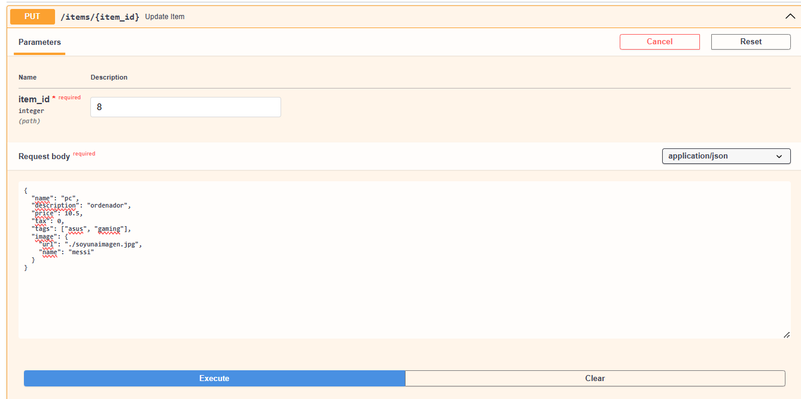
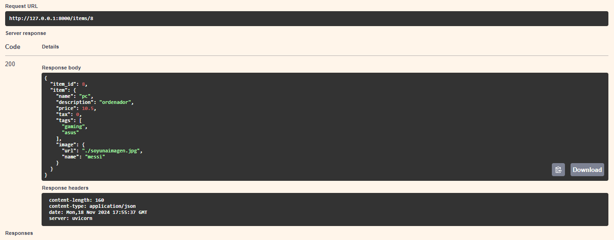

# Activitat 9

## Daniel Vallespin Mellado

### 1. Fields
Serveix per posar validacions, valors per defecge i descripcions als camps d'un objecte.

Codi:

- Falla carcters de mes:

- Falla numero negatius:

- Correcte:

### 2. Nested Models

Serveix per fer servir mes tipus dins d'un BaseModel.

Codi:

- Entrda:

- Sortida:

