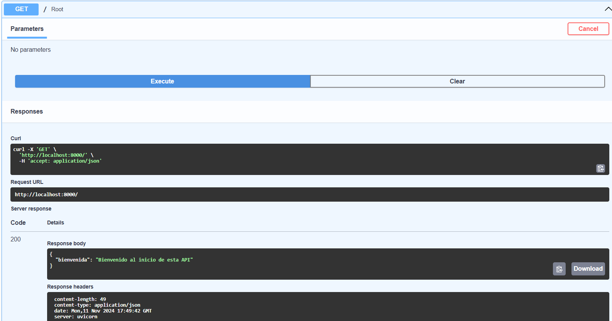
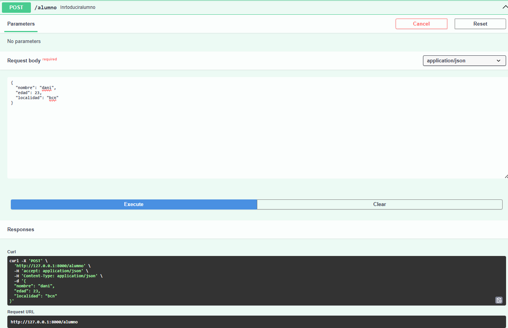
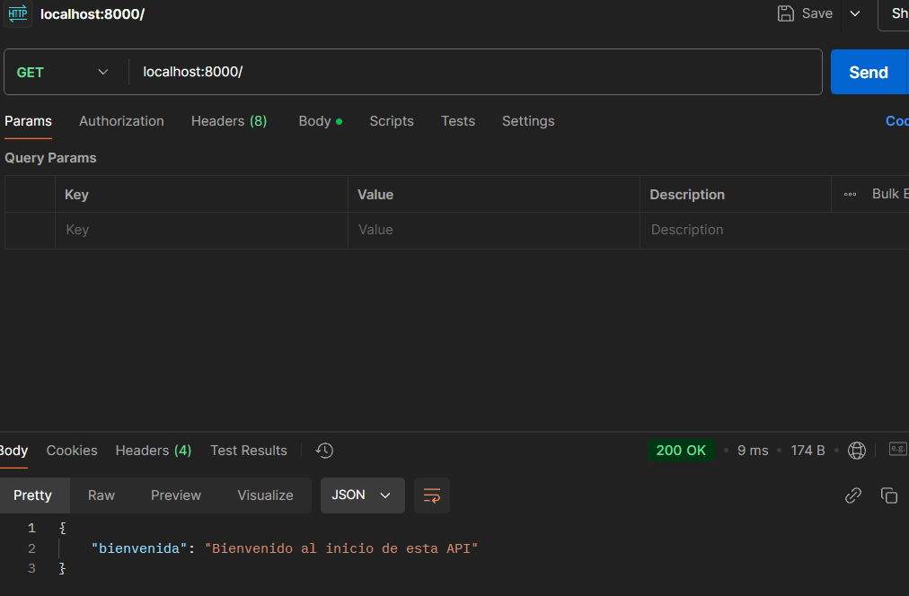
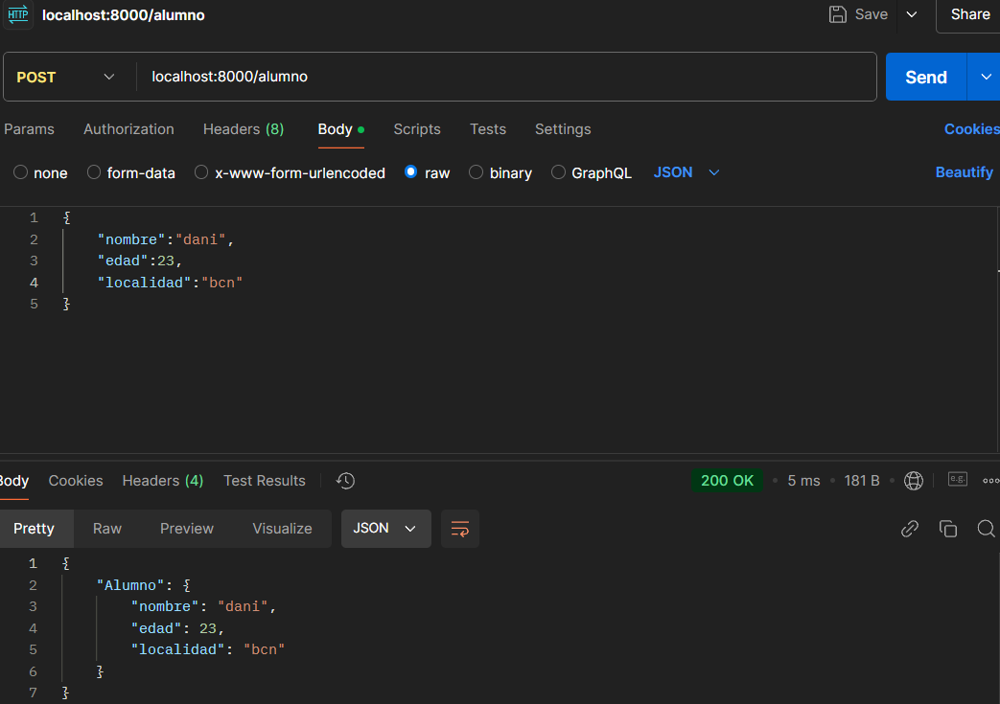
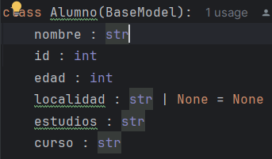
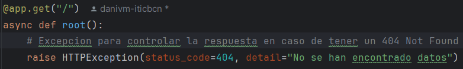
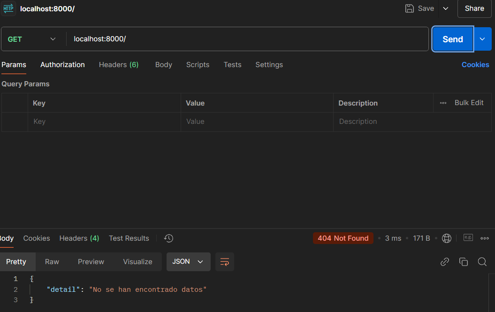
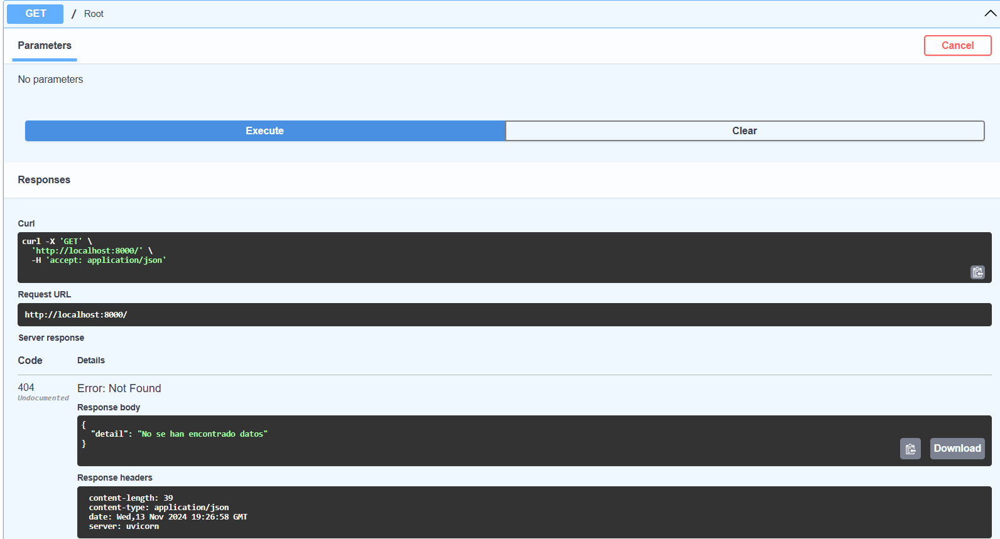

# UF2_FASTAPI

## Daniel Vallespin Mellado

### Activitat 8

#### Get (swagger)

#### Post (swagger)

#### Get (postman)

#### Post (postman)

#### BaseModel amb 6 camps

#### Error amb Response Status Code

#### Tractament d'error amb HTTPException
Codi:

Resultat:

- Postman:

- Swagger:
